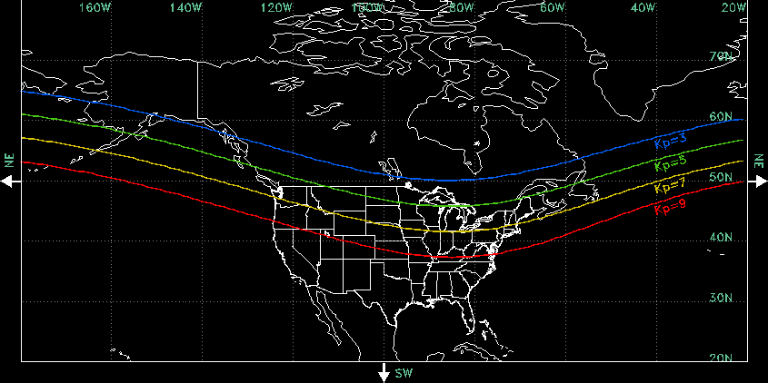
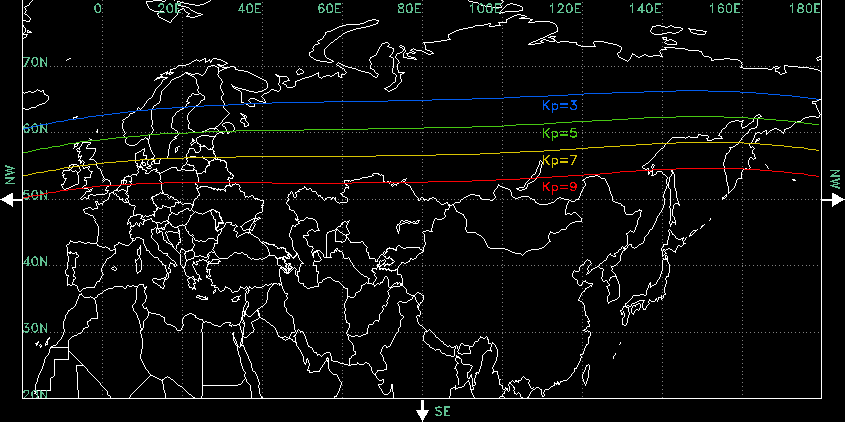

# noaa-aurora

Download space weather information from NOAA related to aurora activity.


## Background

From [Wikipedia](https://en.wikipedia.org/wiki/K-index):

 > The K-index quantifies disturbances in the horizontal component of earth's magnetic field with an integer in the range 0–9 with 1 being calm and 5 or more indicating a geomagnetic storm.

As such, the K-index is a good predictor of aurora activity.

The United States National Oceanic and Atmospheric Administration's
[Space Weather Prediction Center](https://www.swpc.noaa.gov/)
produces forecasts and near real-time measurements of the K-index.

To determine the minimum K-index at which the aurora can be expected to be
visible in your area, refer to the following maps:






## Scripts:

 - `noaa_k_index.py`: Contains classes to download and parse K-index forecast and
   observation data.
 - `noaa_aurora.py`: Example script demonstrating how to use K-index data.
 - `noaa_data_source.py`: Manages periodic downloading of files from NOAA.gov.


## Usage:

```
$ python3 noaa_aurora.py
Maximum Planetary K-Index:
Tonight: 3  Tomorrow: 2  Recently: 3.00
```

```
$ python3 noaa_aurora.py -f visible_tonight
Not visible tonight.
```
